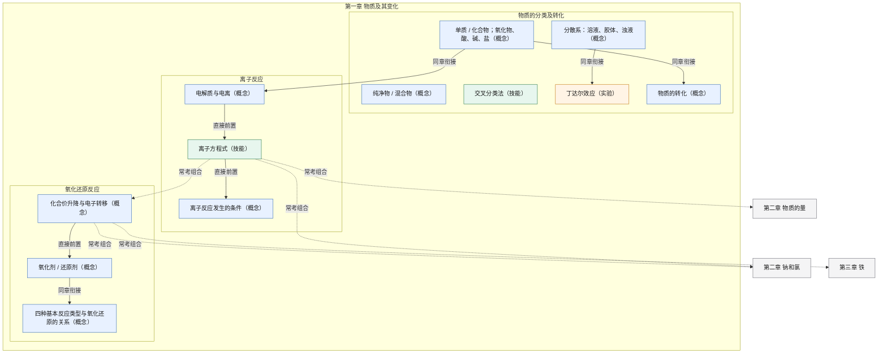
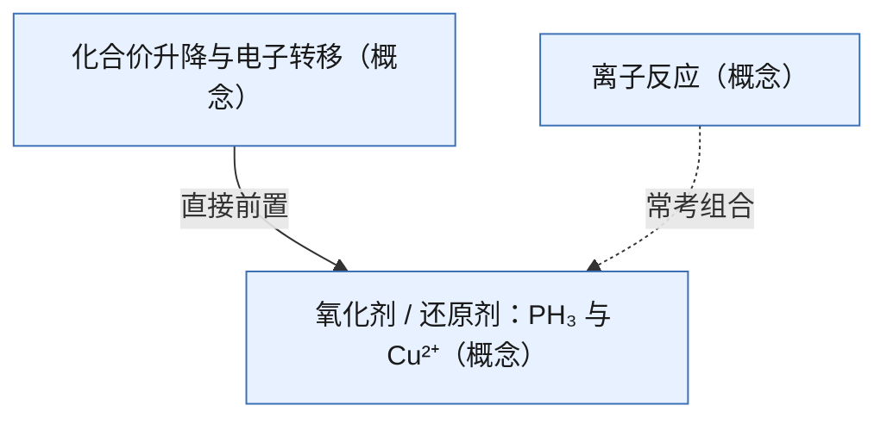

# High School AI Tutor Skill

[](https://github.com/lihenair/high-school-ai-tutor-skill/actions/workflows/ci.yml)

面向中国初高中的讲题 skill。默认苏格拉底式提问；需要完整结果时再切直接讲解。数学、物理、化学、生物已拆成按需加载的分科说明，各科使用自己的难度加权。

## 这是什么

把本目录安装到支持 `SKILL.md` 的 Agent，或把入口和对应分科文件一并提供给对话。按课标和主流教材讲题，生成结构化错题本，并在完整模式下给出变式。

知识图谱：直接问某一章的知识图谱是什么，就用 mermaid 画出当前章。蓝是概念，绿是技能，橙是实验，灰是后续章节。贴题做答时不自动出整章图，只在内部用来选前置和拼盘题。完整讲解和做完后的总结，第 9 节附本题切片，不是整章图。细则见 `docs/usage-guide.md`。

判完一题就在本机记一条（做对、做错或换题时的跳过），苏格拉底的每一小步不记。下次问薄弱点，按这份记录回答，不另编考点。记录在 `~/.high-school-ai-tutor/records.jsonl`。

整章图示例：人教版《化学 必修 第一册》（2019）第一章。跨章只写章名。

整章图：人教版《化学 必修 第一册》（2019）第一章



图例：蓝=概念，绿=技能，橙=实验，灰=后续章节。实线=直接前置或同章衔接，虚线=常考组合。

本题切片示例：2021 年北京高考化学，电石制乙炔并用硫酸铜除杂。只标切口，不写配平和选项结论，也不写入上面的整章图。



skill 本体在 `skills/high-school-ai-tutor/`：`SKILL.md` 是入口，`references/` 是分科说明。仓库本身是一个单插件市场，Claude Code 可直接 `/plugin marketplace add` 安装。

## 包含内容

- `skills/high-school-ai-tutor/SKILL.md`：入口。含 YAML 头、风格判定、错题本规则；语文、英语、文综的难度表暂放在这里
- `skills/high-school-ai-tutor/references/math.md`：数学难度加权、定义域与端点验算
- `skills/high-school-ai-tutor/references/physics.md`：物理难度加权、方向与单位验算
- `skills/high-school-ai-tutor/references/chemistry.md`：化学难度加权、配平与守恒验算
- `skills/high-school-ai-tutor/references/biology.md`：生物难度加权、术语与实验核对
- `skills/high-school-ai-tutor/references/humanities.md`：语文、英语、历史、政治、地理的难度表
- `skills/high-school-ai-tutor/references/pep-chem-bx1-ch1.md`：人教版化学必修第一册（2019）第一章整章图，点名时再读
- `skills/high-school-ai-tutor/scripts/notebook.py`：错题本 SQLite。同一题改一行，复习间隔用 SM-2
- `skills/high-school-ai-tutor/templates/wrong-notebook-generator.py`：把错题本导出成 Excel
- `skills/high-school-ai-tutor/templates/entry-example.json`：`add` 子命令的条目写法示例
- `skills/high-school-ai-tutor/templates/wrong-notebook-template.csv`：错题本 CSV
- `skills/high-school-ai-tutor/templates/validation-tracker.csv`：学习效果记录表
- `skills/high-school-ai-tutor/scripts/guard.py`：回复守卫——发送前机检教学红线（引导模式漏答案、九段标题缺失、非法用词、加权算错；数学完整模式另查机验标记）
- `skills/high-school-ai-tutor/scripts/records.py`：判完一题写一条记录，并汇总薄弱点
- `skills/high-school-ai-tutor/scripts/verify.py`：数学机验。只判定已经抽好的式子，返回通过、矛盾、无法解析、未安装
- `.claude-plugin/marketplace.json`、`.claude-plugin/plugin.json`：插件市场清单
- `docs/`：使用指南、测试标准、效果验证
- `tests/`：守卫用例、清单校验 `check.py`，以及判题记录、错题本、数学机验和 `check.py` 咬合自测

## 安装

**方式一：Claude Code 插件市场（推荐）**

```text
/plugin marketplace add lihenair/high-school-ai-tutor-skill
/plugin install high-school-ai-tutor@lihenair
```

**方式二：手动拷贝到 skills 目录**

把 `skills/high-school-ai-tutor/` 整个目录拷到 Agent 的 skills 路径（Claude Code 用 `~/.claude/skills/`；Codex、Cursor、Gemini CLI 等共用 `~/.agents/skills/`，遵循 Agent Skills 开放标准）：

```bash
cp -r skills/high-school-ai-tutor ~/.claude/skills/
# 或
cp -r skills/high-school-ai-tutor ~/.agents/skills/
```

目录名与 `SKILL.md` 里的 `name: high-school-ai-tutor` 一致，直接 clone 后拷贝即可，无需改名。在设置里刷新并启用后，用该工具调用 skill 的方式点名 `high-school-ai-tutor`，再贴题目。

若工具不会按路径加载 `references/`，发题时把该科目的 `references/*.md` 与 `SKILL.md` 一并提供。

在本仓库里直接对话时，`SKILL.md` 不会自动出现在 Agent 的已安装技能列表里。学生发题、发照片或说自己选了哪个选项，都要先读 `skills/high-school-ai-tutor/SKILL.md`，数理化生再读对应的 `references/`。文件在仓库里，不等于这套讲题规则已经启用。

## 错题本

主库是 `~/.high-school-ai-tutor/tutor.db`。同一科目、考点、题目摘要只留一行。新错题的下次复习是记录日的后一天；复习时按未掌握、模糊、已掌握更新，间隔用 SM-2，不再排死第 1、3、7、15 天。同一题再次写入时只要带了掌握标记，标记没变也会推进下次日期。`records.jsonl` 只记判题结果，不代替错题本。有最终对错就写判题记录；只有该生成错题本条目时才写入数据库。用户说不要错题本时不写数据库。

```bash
python3 skills/high-school-ai-tutor/scripts/notebook.py add entry.json
python3 skills/high-school-ai-tutor/scripts/notebook.py review --id 1 --result 已掌握
python3 skills/high-school-ai-tutor/scripts/notebook.py due
pip install openpyxl
python3 skills/high-school-ai-tutor/scripts/notebook.py export -o 错题本.xlsx
```

`add` 的 JSON 字段与错题记录表列名一致（写法见 `templates/entry-example.json`）：`科目`、`题目摘要` 必填。导出的 Excel 仍是三张表：错题记录、复习计划、统计看板。复习计划列出下次复习日、间隔天数和难度系数。

## 判题记录与薄弱点

一题有了最终结果才记一条：独立做对、没做对而进入完整讲解，或换题前还没有对错。同一小步说「过」不记。用户不要完整错题本时，这条短记录仍然写。

```bash
python3 skills/high-school-ai-tutor/scripts/records.py add --subject 化学 --node "氧化还原反应" --stem "电石除杂" --outcome 做错 --error 概念
python3 skills/high-school-ai-tutor/scripts/records.py weak
```

`weak` 只按已有记录汇总。没有记录时输出「还没有判过的题。」有记录但做错和跳过没有超过做对时，输出「目前没有薄弱点。」默认文件是 `~/.high-school-ai-tutor/records.jsonl`。

## 回复守卫

`skills/high-school-ai-tutor/scripts/guard.py` 在发送前机检回复红线，退出码 0 才发送；违规清单附行号与规则出处：

```bash
python3 skills/high-school-ai-tutor/scripts/guard.py --mode socratic reply.txt    # 引导模式（苏格拉底）
python3 skills/high-school-ai-tutor/scripts/guard.py --mode full reply.txt        # 完整模式 / 总结阶段
python3 skills/high-school-ai-tutor/scripts/guard.py --mode socratic --no-student-answer reply.txt
python3 skills/high-school-ai-tutor/scripts/guard.py --mode full --subject math reply.txt   # 数学完整模式：额外查机验标记
```

引导模式查：漏答案、报加权、输出总结标题、错题本条目、问号过多、先说破关键公式。完整模式查：九段标题齐全、第 9 节有本题 mermaid 图谱、难度用词、加权与五项分一致。两种模式都查边标签；只有写明人教版化学必修第一册（2019）第一章整章图时，才核这一章的节点是否齐全。`--no-student-answer` 拦截无学生作答时编造「我的错误」。数学完整模式加上 `--subject math`，并要求第 2 节末尾出现机验标记。守卫只查红线，查不出内容对错——验算仍按各科 reference 清单做。数学式子交给下一节的 `verify.py`。

## 数学机验

数学完整模式在写出第 2 节之前，把最终式和条件交给 `scripts/verify.py`。只传入已经抽好的式子，不送整段回复，也不送中文大题原文。

```bash
python3 skills/high-school-ai-tutor/scripts/verify.py --expr "最终式" --where "条件"
python3 skills/high-school-ai-tutor/scripts/verify.py --expr "2 + 2 == 4"
```

stdout 第一行是状态词，退出码为通过 0、矛盾 1、无法解析 3、未安装 4（2 留给用法错误）。有细节时第二行以 `detail:` 开头。只有「矛盾」拦住发送。通过时回复写「已机验：通过」；无法解析写「未机验：无法解析」；没装 SymPy 写「未机验：未安装 SymPy」。连续两次矛盾后写「此结果未通过机验」，不要把矛盾的式子当成正确答案。语文、英语、史政地的完整讲解不写这些句子。物理里已经抽成数值式的计算，以及生物里抽成式子的比例、浓度、计数，用同一个入口。单位、化学方程式配平、生物概念和实验结论这一版不机验。

## 本地检查

与 CI 同一批命令。咬合自测只读常量，放在安装 SymPy 之前即可。

```bash
bash tests/run.sh
python3 tests/check.py
python3 tests/test_check_bites.py
python3 tests/test_records.py
python3 tests/test_notebook.py
pip install 'sympy==1.13.3'
python3 tests/test_verify.py
```

`tests/check.py` 核对插件清单、技能目录和 `SKILL.md`：机验标记、状态词，以及 `guard.py` 的每个命令行参数，都要还在文档里。`tests/test_check_bites.py` 在临时整仓副本里各拆一条（删掉 `--subject` 那一行、把状态词 `通过` 改成 `通过_X`、删掉最后一条机验标记），确认退出码非零，且失败原因就是被拆的那一条。副本忽略 `.git`、`__pycache__`、`*.pyc` 和 `.venv`，不改真实工作树。错题本 Excel 冒烟另在 CI 里跑，需要 `openpyxl`。
