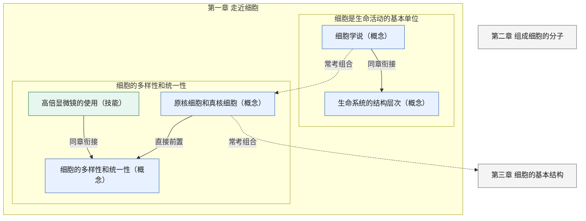

学生问人教版《生物学 必修1 分子与细胞》（2019）第一章的知识图谱时，从「整章图」那一行起原样输出，不要改节点、边和配色。

整章图：人教版《生物学 必修1 分子与细胞》（2019）第一章

```mermaid
flowchart TD
  classDef concept fill:#E8F1FF,stroke:#3B6FB6,color:#1A1A1A
  classDef skill fill:#E7F6EE,stroke:#2E7D4F,color:#1A1A1A
  classDef experiment fill:#FFF4E5,stroke:#C47B17,color:#1A1A1A
  classDef later fill:#F4F4F5,stroke:#71717A,color:#1A1A1A
  subgraph ch["第一章 走近细胞"]
    subgraph s1["细胞是生命活动的基本单位"]
      kp_cell_theory["细胞学说（概念）"]:::concept
      kp_life_system["生命系统的结构层次（概念）"]:::concept
    end
    subgraph s2["细胞的多样性和统一性"]
      kp_microscope_use["高倍显微镜的使用（技能）"]:::skill
      kp_prokaryote_eukaryote["原核细胞和真核细胞（概念）"]:::concept
      kp_cell_diversity_unity["细胞的多样性和统一性（概念）"]:::concept
    end
  end
  bx1_ch2["第二章 组成细胞的分子"]:::later
  bx1_ch3["第三章 细胞的基本结构"]:::later
  kp_cell_theory -->|同章衔接| kp_life_system
  kp_microscope_use -->|同章衔接| kp_cell_diversity_unity
  kp_prokaryote_eukaryote -->|直接前置| kp_cell_diversity_unity
  kp_cell_theory -.->|常考组合| kp_prokaryote_eukaryote
  kp_prokaryote_eukaryote -.->|常考组合| bx1_ch3
```

图例：蓝=概念，绿=技能，橙=实验，灰=后续章节。实线=直接前置或同章衔接，虚线=常考组合。

先学哪个节点：细胞学说、生命系统的结构层次，还是细胞的多样性和统一性？
