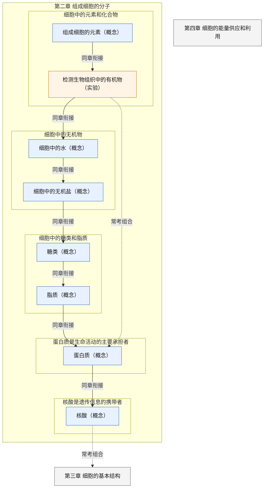

学生问人教版《生物学 必修1 分子与细胞》（2019）第二章的知识图谱时，从「整章图」那一行起原样输出，不要改节点、边和配色。

整章图：人教版《生物学 必修1 分子与细胞》（2019）第二章

```mermaid
flowchart TD
  classDef concept fill:#E8F1FF,stroke:#3B6FB6,color:#1A1A1A
  classDef skill fill:#E7F6EE,stroke:#2E7D4F,color:#1A1A1A
  classDef experiment fill:#FFF4E5,stroke:#C47B17,color:#1A1A1A
  classDef later fill:#F4F4F5,stroke:#71717A,color:#1A1A1A
  subgraph ch["第二章 组成细胞的分子"]
    subgraph s1["细胞中的元素和化合物"]
      kp_elements["组成细胞的元素（概念）"]:::concept
      kp_biomass_detection["检测生物组织中的有机物（实验）"]:::experiment
    end
    subgraph s2["细胞中的无机物"]
      kp_water["细胞中的水（概念）"]:::concept
      kp_inorganic_salts["细胞中的无机盐（概念）"]:::concept
    end
    subgraph s3["细胞中的糖类和脂质"]
      kp_sugars["糖类（概念）"]:::concept
      kp_lipids["脂质（概念）"]:::concept
    end
    subgraph s4["蛋白质是生命活动的主要承担者"]
      kp_proteins["蛋白质（概念）"]:::concept
    end
    subgraph s5["核酸是遗传信息的携带者"]
      kp_nucleic_acids["核酸（概念）"]:::concept
    end
  end
  bx1_ch3["第三章 细胞的基本结构"]:::later
  bx1_ch4["第四章 细胞的能量供应和利用"]:::later
  kp_elements -->|同章衔接| kp_biomass_detection
  kp_biomass_detection -->|同章衔接| kp_water
  kp_water -->|同章衔接| kp_inorganic_salts
  kp_inorganic_salts -->|同章衔接| kp_sugars
  kp_sugars -->|同章衔接| kp_lipids
  kp_lipids -->|同章衔接| kp_proteins
  kp_proteins -->|同章衔接| kp_nucleic_acids
  kp_biomass_detection -.->|常考组合| kp_proteins
  kp_nucleic_acids -.->|常考组合| bx1_ch3
```

图例：蓝=概念，绿=技能，橙=实验，灰=后续章节。实线=直接前置或同章衔接，虚线=常考组合。

先学哪个节点：元素和化合物、水与无机盐，还是蛋白质？
