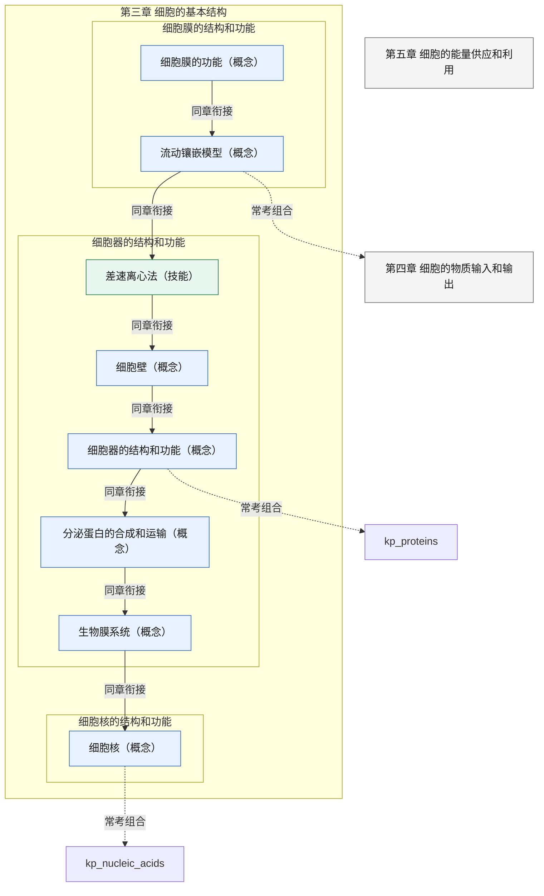

学生问人教版《生物学 必修1 分子与细胞》（2019）第三章的知识图谱时，从「整章图」那一行起原样输出，不要改节点、边和配色。

整章图：人教版《生物学 必修1 分子与细胞》（2019）第三章

```mermaid
flowchart TD
  classDef concept fill:#E8F1FF,stroke:#3B6FB6,color:#1A1A1A
  classDef skill fill:#E7F6EE,stroke:#2E7D4F,color:#1A1A1A
  classDef experiment fill:#FFF4E5,stroke:#C47B17,color:#1A1A1A
  classDef later fill:#F4F4F5,stroke:#71717A,color:#1A1A1A
  subgraph ch["第三章 细胞的基本结构"]
    subgraph s1["细胞膜的结构和功能"]
      kp_cell_membrane_functions["细胞膜的功能（概念）"]:::concept
      kp_fluid_mosaic["流动镶嵌模型（概念）"]:::concept
    end
    subgraph s2["细胞器的结构和功能"]
      kp_differential_centrifugation["差速离心法（技能）"]:::skill
      kp_cell_wall["细胞壁（概念）"]:::concept
      kp_organelles["细胞器的结构和功能（概念）"]:::concept
      kp_secretory_protein["分泌蛋白的合成和运输（概念）"]:::concept
      kp_biomembrane_system["生物膜系统（概念）"]:::concept
    end
    subgraph s3["细胞核的结构和功能"]
      kp_nucleus["细胞核（概念）"]:::concept
    end
  end
  bx1_ch4["第四章 细胞的物质输入和输出"]:::later
  bx1_ch5["第五章 细胞的能量供应和利用"]:::later
  kp_cell_membrane_functions -->|同章衔接| kp_fluid_mosaic
  kp_fluid_mosaic -->|同章衔接| kp_differential_centrifugation
  kp_differential_centrifugation -->|同章衔接| kp_cell_wall
  kp_cell_wall -->|同章衔接| kp_organelles
  kp_organelles -->|同章衔接| kp_secretory_protein
  kp_secretory_protein -->|同章衔接| kp_biomembrane_system
  kp_biomembrane_system -->|同章衔接| kp_nucleus
  kp_fluid_mosaic -.->|常考组合| bx1_ch4
  kp_organelles -.->|常考组合| kp_proteins
  kp_nucleus -.->|常考组合| kp_nucleic_acids
```

图例：蓝=概念，绿=技能，橙=实验，灰=后续章节。实线=直接前置或同章衔接，虚线=常考组合。

先学哪个节点：细胞膜的功能、细胞器的分工，还是细胞核？
