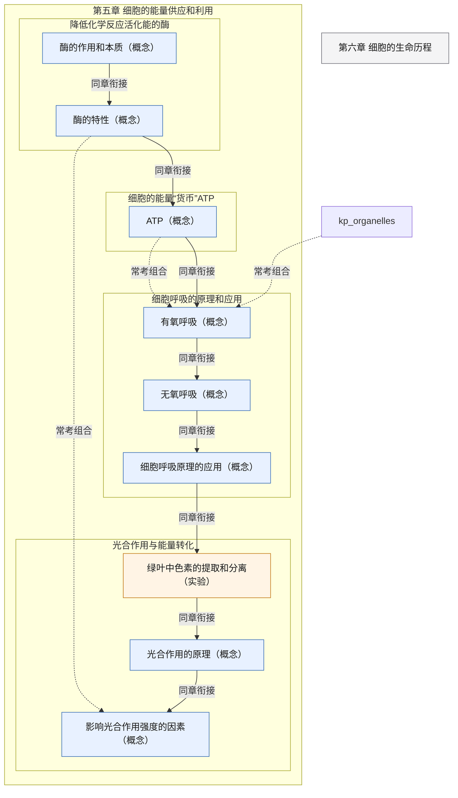

学生问人教版《生物学 必修1 分子与细胞》（2019）第五章的知识图谱时，从「整章图」那一行起原样输出，不要改节点、边和配色。

整章图：人教版《生物学 必修1 分子与细胞》（2019）第五章

```mermaid
flowchart TD
  classDef concept fill:#E8F1FF,stroke:#3B6FB6,color:#1A1A1A
  classDef skill fill:#E7F6EE,stroke:#2E7D4F,color:#1A1A1A
  classDef experiment fill:#FFF4E5,stroke:#C47B17,color:#1A1A1A
  classDef later fill:#F4F4F5,stroke:#71717A,color:#1A1A1A
  subgraph ch["第五章 细胞的能量供应和利用"]
    subgraph s1["降低化学反应活化能的酶"]
      kp_enzyme_role["酶的作用和本质（概念）"]:::concept
      kp_enzyme_properties["酶的特性（概念）"]:::concept
    end
    subgraph s2["细胞的能量“货币”ATP"]
      kp_atp["ATP（概念）"]:::concept
    end
    subgraph s3["细胞呼吸的原理和应用"]
      kp_aerobic_respiration["有氧呼吸（概念）"]:::concept
      kp_anaerobic_respiration["无氧呼吸（概念）"]:::concept
      kp_respiration_application["细胞呼吸原理的应用（概念）"]:::concept
    end
    subgraph s4["光合作用与能量转化"]
      kp_pigment_separation["绿叶中色素的提取和分离（实验）"]:::experiment
      kp_photosynthesis_principle["光合作用的原理（概念）"]:::concept
      kp_photosynthesis_factors["影响光合作用强度的因素（概念）"]:::concept
    end
  end
  bx1_ch6["第六章 细胞的生命历程"]:::later
  kp_enzyme_role -->|同章衔接| kp_enzyme_properties
  kp_enzyme_properties -->|同章衔接| kp_atp
  kp_atp -->|同章衔接| kp_aerobic_respiration
  kp_aerobic_respiration -->|同章衔接| kp_anaerobic_respiration
  kp_anaerobic_respiration -->|同章衔接| kp_respiration_application
  kp_respiration_application -->|同章衔接| kp_pigment_separation
  kp_pigment_separation -->|同章衔接| kp_photosynthesis_principle
  kp_photosynthesis_principle -->|同章衔接| kp_photosynthesis_factors
  kp_atp -.->|常考组合| kp_aerobic_respiration
  kp_organelles -.->|常考组合| kp_aerobic_respiration
  kp_enzyme_properties -.->|常考组合| kp_photosynthesis_factors
```

图例：蓝=概念，绿=技能，橙=实验，灰=后续章节。实线=直接前置或同章衔接，虚线=常考组合。

先学哪个节点：酶、ATP，还是细胞呼吸和光合作用？
