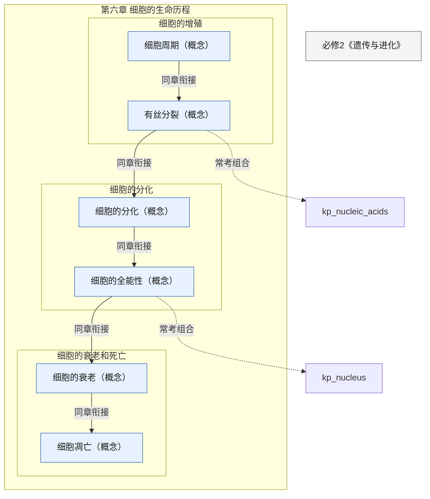

学生问人教版《生物学 必修1 分子与细胞》（2019）第六章的知识图谱时，从「整章图」那一行起原样输出，不要改节点、边和配色。

整章图：人教版《生物学 必修1 分子与细胞》（2019）第六章

```mermaid
flowchart TD
  classDef concept fill:#E8F1FF,stroke:#3B6FB6,color:#1A1A1A
  classDef skill fill:#E7F6EE,stroke:#2E7D4F,color:#1A1A1A
  classDef experiment fill:#FFF4E5,stroke:#C47B17,color:#1A1A1A
  classDef later fill:#F4F4F5,stroke:#71717A,color:#1A1A1A
  subgraph ch["第六章 细胞的生命历程"]
    subgraph s1["细胞的增殖"]
      kp_cell_cycle["细胞周期（概念）"]:::concept
      kp_mitosis["有丝分裂（概念）"]:::concept
    end
    subgraph s2["细胞的分化"]
      kp_cell_differentiation["细胞的分化（概念）"]:::concept
      kp_totipotency["细胞的全能性（概念）"]:::concept
    end
    subgraph s3["细胞的衰老和死亡"]
      kp_cell_aging["细胞的衰老（概念）"]:::concept
      kp_cell_death["细胞凋亡（概念）"]:::concept
    end
  end
  bio_bx2["必修2《遗传与进化》"]:::later
  kp_cell_cycle -->|同章衔接| kp_mitosis
  kp_mitosis -->|同章衔接| kp_cell_differentiation
  kp_cell_differentiation -->|同章衔接| kp_totipotency
  kp_totipotency -->|同章衔接| kp_cell_aging
  kp_cell_aging -->|同章衔接| kp_cell_death
  kp_mitosis -.->|常考组合| kp_nucleic_acids
  kp_totipotency -.->|常考组合| kp_nucleus
```

图例：蓝=概念，绿=技能，橙=实验，灰=后续章节。实线=直接前置或同章衔接，虚线=常考组合。

先学哪个节点：细胞的增殖、细胞的分化，还是细胞的衰老和凋亡？
