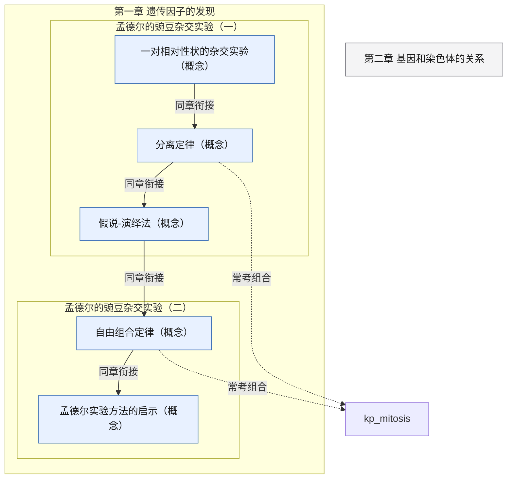

学生问人教版《生物学 必修2 遗传与进化》（2019）第一章的知识图谱时，从「整章图」那一行起原样输出，不要改节点、边和配色。

整章图：人教版《生物学 必修2 遗传与进化》（2019）第一章

```mermaid
flowchart TD
  classDef concept fill:#E8F1FF,stroke:#3B6FB6,color:#1A1A1A
  classDef skill fill:#E7F6EE,stroke:#2E7D4F,color:#1A1A1A
  classDef experiment fill:#FFF4E5,stroke:#C47B17,color:#1A1A1A
  classDef later fill:#F4F4F5,stroke:#71717A,color:#1A1A1A
  subgraph ch["第一章 遗传因子的发现"]
    subgraph s1["孟德尔的豌豆杂交实验（一）"]
      kp_mendel_pea_cross["一对相对性状的杂交实验（概念）"]:::concept
      kp_segregation_law["分离定律（概念）"]:::concept
      kp_hypothesis_deduction["假说-演绎法（概念）"]:::concept
    end
    subgraph s2["孟德尔的豌豆杂交实验（二）"]
      kp_free_combination["自由组合定律（概念）"]:::concept
      kp_mendel_methods["孟德尔实验方法的启示（概念）"]:::concept
    end
  end
  bx2_ch2["第二章 基因和染色体的关系"]:::later
  kp_mendel_pea_cross -->|同章衔接| kp_segregation_law
  kp_segregation_law -->|同章衔接| kp_hypothesis_deduction
  kp_hypothesis_deduction -->|同章衔接| kp_free_combination
  kp_free_combination -->|同章衔接| kp_mendel_methods
  kp_segregation_law -.->|常考组合| kp_mitosis
  kp_free_combination -.->|常考组合| kp_mitosis
```

图例：蓝=概念，绿=技能，橙=实验，灰=后续章节。实线=直接前置或同章衔接，虚线=常考组合。

先学哪个节点：一对相对性状的杂交实验、分离定律，还是自由组合定律？
