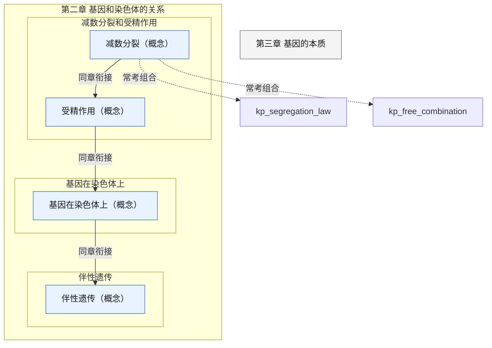

学生问人教版《生物学 必修2 遗传与进化》（2019）第二章的知识图谱时，从「整章图」那一行起原样输出，不要改节点、边和配色。

整章图：人教版《生物学 必修2 遗传与进化》（2019）第二章

```mermaid
flowchart TD
  classDef concept fill:#E8F1FF,stroke:#3B6FB6,color:#1A1A1A
  classDef skill fill:#E7F6EE,stroke:#2E7D4F,color:#1A1A1A
  classDef experiment fill:#FFF4E5,stroke:#C47B17,color:#1A1A1A
  classDef later fill:#F4F4F5,stroke:#71717A,color:#1A1A1A
  subgraph ch["第二章 基因和染色体的关系"]
    subgraph s1["减数分裂和受精作用"]
      kp_meiosis["减数分裂（概念）"]:::concept
      kp_fertilization["受精作用（概念）"]:::concept
    end
    subgraph s2["基因在染色体上"]
      kp_gene_on_chromosome["基因在染色体上（概念）"]:::concept
    end
    subgraph s3["伴性遗传"]
      kp_sex_linked["伴性遗传（概念）"]:::concept
    end
  end
  bx2_ch3["第三章 基因的本质"]:::later
  kp_meiosis -->|同章衔接| kp_fertilization
  kp_fertilization -->|同章衔接| kp_gene_on_chromosome
  kp_gene_on_chromosome -->|同章衔接| kp_sex_linked
  kp_meiosis -.->|常考组合| kp_segregation_law
  kp_meiosis -.->|常考组合| kp_free_combination
```

图例：蓝=概念，绿=技能，橙=实验，灰=后续章节。实线=直接前置或同章衔接，虚线=常考组合。

先学哪个节点：减数分裂、受精作用，还是伴性遗传？
