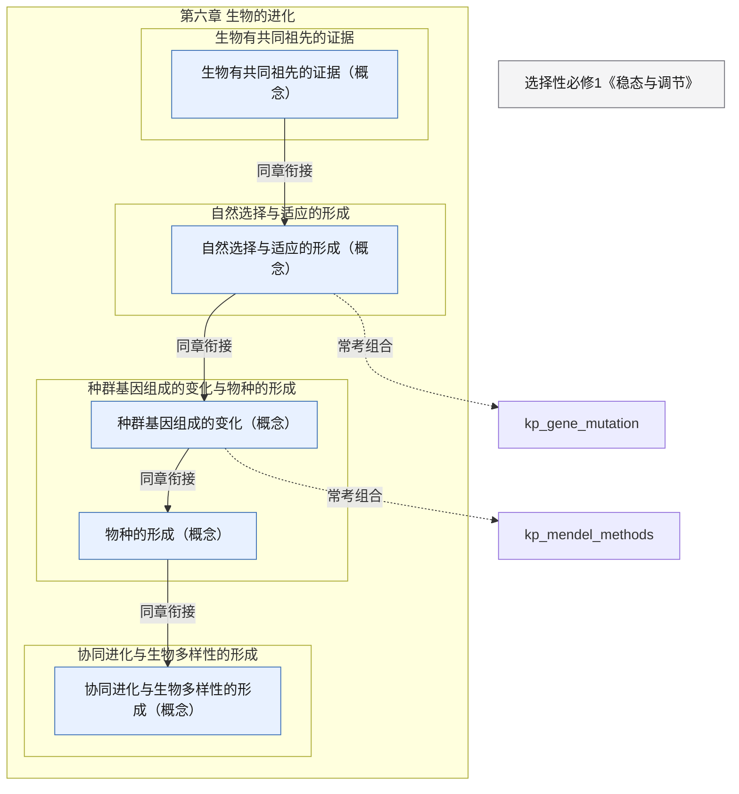

学生问人教版《生物学 必修2 遗传与进化》（2019）第六章的知识图谱时，从「整章图」那一行起原样输出，不要改节点、边和配色。

整章图：人教版《生物学 必修2 遗传与进化》（2019）第六章

```mermaid
flowchart TD
  classDef concept fill:#E8F1FF,stroke:#3B6FB6,color:#1A1A1A
  classDef skill fill:#E7F6EE,stroke:#2E7D4F,color:#1A1A1A
  classDef experiment fill:#FFF4E5,stroke:#C47B17,color:#1A1A1A
  classDef later fill:#F4F4F5,stroke:#71717A,color:#1A1A1A
  subgraph ch["第六章 生物的进化"]
    subgraph s1["生物有共同祖先的证据"]
      kp_common_ancestor["生物有共同祖先的证据（概念）"]:::concept
    end
    subgraph s2["自然选择与适应的形成"]
      kp_natural_selection_adaptation["自然选择与适应的形成（概念）"]:::concept
    end
    subgraph s3["种群基因组成的变化与物种的形成"]
      kp_population_gene_frequency["种群基因组成的变化（概念）"]:::concept
      kp_speciation["物种的形成（概念）"]:::concept
    end
    subgraph s4["协同进化与生物多样性的形成"]
      kp_coevolution_biodiversity["协同进化与生物多样性的形成（概念）"]:::concept
    end
  end
  bio_xbx1["选择性必修1《稳态与调节》"]:::later
  kp_common_ancestor -->|同章衔接| kp_natural_selection_adaptation
  kp_natural_selection_adaptation -->|同章衔接| kp_population_gene_frequency
  kp_population_gene_frequency -->|同章衔接| kp_speciation
  kp_speciation -->|同章衔接| kp_coevolution_biodiversity
  kp_natural_selection_adaptation -.->|常考组合| kp_gene_mutation
  kp_population_gene_frequency -.->|常考组合| kp_mendel_methods
```

图例：蓝=概念，绿=技能，橙=实验，灰=后续章节。实线=直接前置或同章衔接，虚线=常考组合。

先学哪个节点：共同祖先的证据、自然选择与适应，还是生物多样性的形成？
