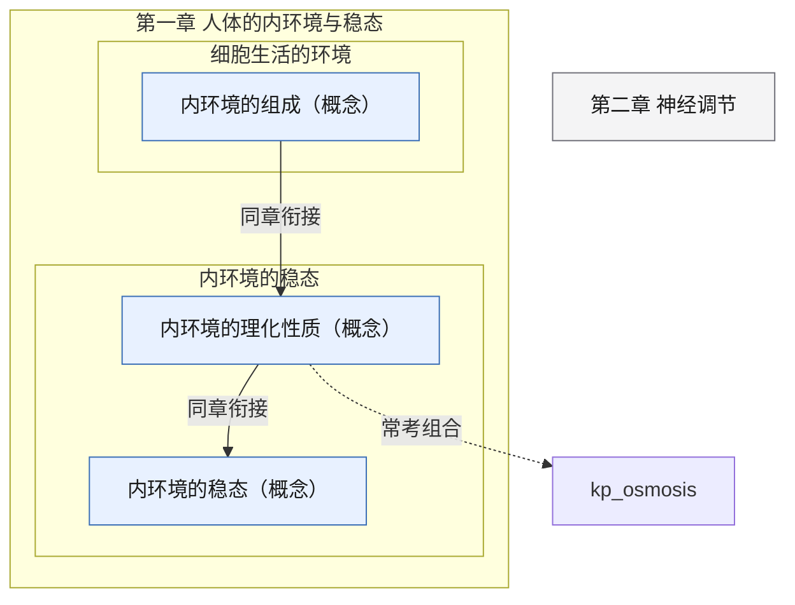

学生问人教版《生物学 选择性必修1 稳态与调节》（2019）第一章的知识图谱时，从「整章图」那一行起原样输出，不要改节点、边和配色。

整章图：人教版《生物学 选择性必修1 稳态与调节》（2019）第一章

```mermaid
flowchart TD
  classDef concept fill:#E8F1FF,stroke:#3B6FB6,color:#1A1A1A
  classDef skill fill:#E7F6EE,stroke:#2E7D4F,color:#1A1A1A
  classDef experiment fill:#FFF4E5,stroke:#C47B17,color:#1A1A1A
  classDef later fill:#F4F4F5,stroke:#71717A,color:#1A1A1A
  subgraph ch["第一章 人体的内环境与稳态"]
    subgraph s1["细胞生活的环境"]
      kp_internal_environment["内环境的组成（概念）"]:::concept
    end
    subgraph s2["内环境的稳态"]
      kp_internal_env_properties["内环境的理化性质（概念）"]:::concept
      kp_homeostasis["内环境的稳态（概念）"]:::concept
    end
  end
  xbx1_ch2["第二章 神经调节"]:::later
  kp_internal_environment -->|同章衔接| kp_internal_env_properties
  kp_internal_env_properties -->|同章衔接| kp_homeostasis
  kp_internal_env_properties -.->|常考组合| kp_osmosis
```

图例：蓝=概念，绿=技能，橙=实验，灰=后续章节。实线=直接前置或同章衔接，虚线=常考组合。

先学哪个节点：内环境的组成、内环境的理化性质，还是内环境的稳态？
