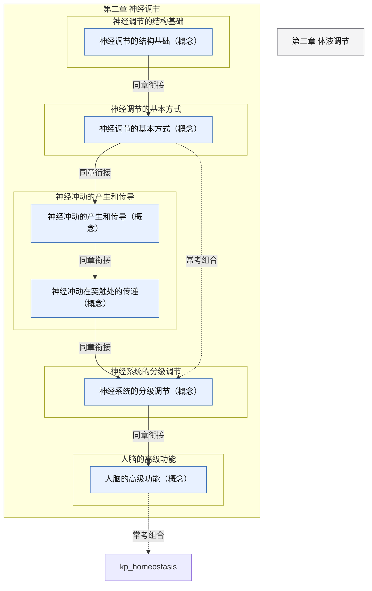

学生问人教版《生物学 选择性必修1 稳态与调节》（2019）第二章的知识图谱时，从「整章图」那一行起原样输出，不要改节点、边和配色。

整章图：人教版《生物学 选择性必修1 稳态与调节》（2019）第二章

```mermaid
flowchart TD
  classDef concept fill:#E8F1FF,stroke:#3B6FB6,color:#1A1A1A
  classDef skill fill:#E7F6EE,stroke:#2E7D4F,color:#1A1A1A
  classDef experiment fill:#FFF4E5,stroke:#C47B17,color:#1A1A1A
  classDef later fill:#F4F4F5,stroke:#71717A,color:#1A1A1A
  subgraph ch["第二章 神经调节"]
    subgraph s1["神经调节的结构基础"]
      kp_neuron_structure["神经调节的结构基础（概念）"]:::concept
    end
    subgraph s2["神经调节的基本方式"]
      kp_reflex_arc["神经调节的基本方式（概念）"]:::concept
    end
    subgraph s3["神经冲动的产生和传导"]
      kp_nerve_impulse["神经冲动的产生和传导（概念）"]:::concept
      kp_synapse["神经冲动在突触处的传递（概念）"]:::concept
    end
    subgraph s4["神经系统的分级调节"]
      kp_hierarchical_regulation["神经系统的分级调节（概念）"]:::concept
    end
    subgraph s5["人脑的高级功能"]
      kp_brain_functions["人脑的高级功能（概念）"]:::concept
    end
  end
  xbx1_ch3["第三章 体液调节"]:::later
  kp_neuron_structure -->|同章衔接| kp_reflex_arc
  kp_reflex_arc -->|同章衔接| kp_nerve_impulse
  kp_nerve_impulse -->|同章衔接| kp_synapse
  kp_synapse -->|同章衔接| kp_hierarchical_regulation
  kp_hierarchical_regulation -->|同章衔接| kp_brain_functions
  kp_reflex_arc -.->|常考组合| kp_hierarchical_regulation
  kp_brain_functions -.->|常考组合| kp_homeostasis
```

图例：蓝=概念，绿=技能，橙=实验，灰=后续章节。实线=直接前置或同章衔接，虚线=常考组合。

先学哪个节点：神经调节的结构基础、反射与反射弧，还是神经冲动的传导？
