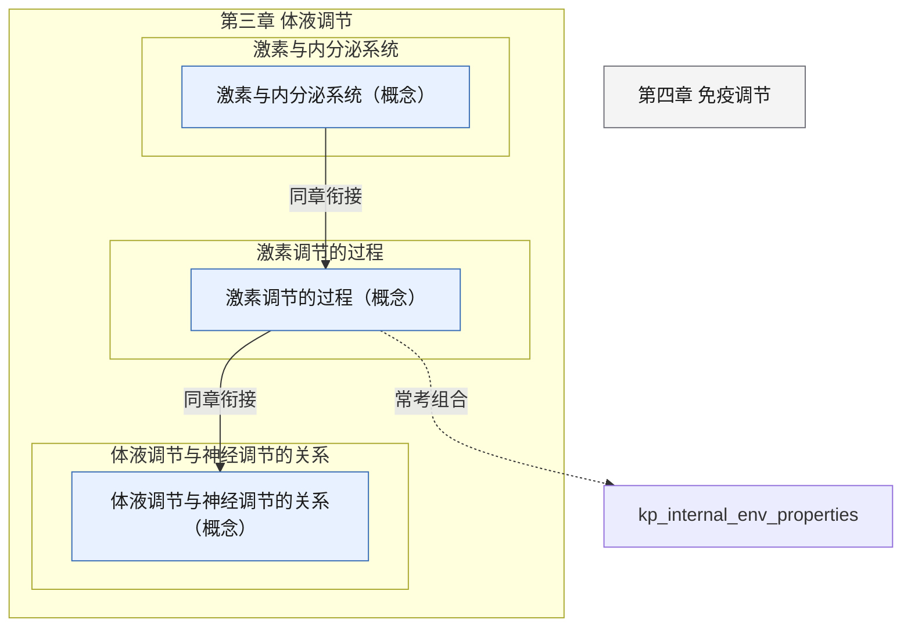

学生问人教版《生物学 选择性必修1 稳态与调节》（2019）第三章的知识图谱时，从「整章图」那一行起原样输出，不要改节点、边和配色。

整章图：人教版《生物学 选择性必修1 稳态与调节》（2019）第三章

```mermaid
flowchart TD
  classDef concept fill:#E8F1FF,stroke:#3B6FB6,color:#1A1A1A
  classDef skill fill:#E7F6EE,stroke:#2E7D4F,color:#1A1A1A
  classDef experiment fill:#FFF4E5,stroke:#C47B17,color:#1A1A1A
  classDef later fill:#F4F4F5,stroke:#71717A,color:#1A1A1A
  subgraph ch["第三章 体液调节"]
    subgraph s1["激素与内分泌系统"]
      kp_hormones_endocrine["激素与内分泌系统（概念）"]:::concept
    end
    subgraph s2["激素调节的过程"]
      kp_hormone_process["激素调节的过程（概念）"]:::concept
    end
    subgraph s3["体液调节与神经调节的关系"]
      kp_humoral_nervous["体液调节与神经调节的关系（概念）"]:::concept
    end
  end
  xbx1_ch4["第四章 免疫调节"]:::later
  kp_hormones_endocrine -->|同章衔接| kp_hormone_process
  kp_hormone_process -->|同章衔接| kp_humoral_nervous
  kp_hormone_process -.->|常考组合| kp_internal_env_properties
```

图例：蓝=概念，绿=技能，橙=实验，灰=后续章节。实线=直接前置或同章衔接，虚线=常考组合。

先学哪个节点：激素与内分泌系统、激素调节的过程，还是体液调节与神经调节的关系？
