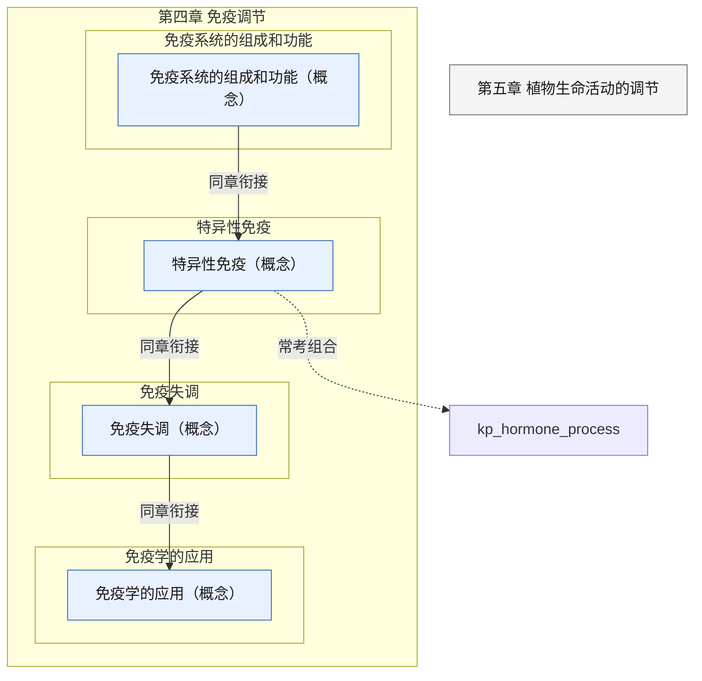

学生问人教版《生物学 选择性必修1 稳态与调节》（2019）第四章的知识图谱时，从「整章图」那一行起原样输出，不要改节点、边和配色。

整章图：人教版《生物学 选择性必修1 稳态与调节》（2019）第四章

```mermaid
flowchart TD
  classDef concept fill:#E8F1FF,stroke:#3B6FB6,color:#1A1A1A
  classDef skill fill:#E7F6EE,stroke:#2E7D4F,color:#1A1A1A
  classDef experiment fill:#FFF4E5,stroke:#C47B17,color:#1A1A1A
  classDef later fill:#F4F4F5,stroke:#71717A,color:#1A1A1A
  subgraph ch["第四章 免疫调节"]
    subgraph s1["免疫系统的组成和功能"]
      kp_immune_system["免疫系统的组成和功能（概念）"]:::concept
    end
    subgraph s2["特异性免疫"]
      kp_specific_immunity["特异性免疫（概念）"]:::concept
    end
    subgraph s3["免疫失调"]
      kp_immune_disorder["免疫失调（概念）"]:::concept
    end
    subgraph s4["免疫学的应用"]
      kp_immune_application["免疫学的应用（概念）"]:::concept
    end
  end
  xbx1_ch5["第五章 植物生命活动的调节"]:::later
  kp_immune_system -->|同章衔接| kp_specific_immunity
  kp_specific_immunity -->|同章衔接| kp_immune_disorder
  kp_immune_disorder -->|同章衔接| kp_immune_application
  kp_specific_immunity -.->|常考组合| kp_hormone_process
```

图例：蓝=概念，绿=技能，橙=实验，灰=后续章节。实线=直接前置或同章衔接，虚线=常考组合。

先学哪个节点：免疫系统的组成和功能、特异性免疫，还是免疫失调？
