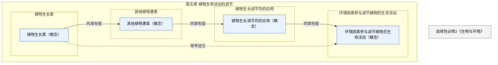

学生问人教版《生物学 选择性必修1 稳态与调节》（2019）第五章的知识图谱时，从「整章图」那一行起原样输出，不要改节点、边和配色。

整章图：人教版《生物学 选择性必修1 稳态与调节》（2019）第五章

```mermaid
flowchart TD
  classDef concept fill:#E8F1FF,stroke:#3B6FB6,color:#1A1A1A
  classDef skill fill:#E7F6EE,stroke:#2E7D4F,color:#1A1A1A
  classDef experiment fill:#FFF4E5,stroke:#C47B17,color:#1A1A1A
  classDef later fill:#F4F4F5,stroke:#71717A,color:#1A1A1A
  subgraph ch["第五章 植物生命活动的调节"]
    subgraph s1["植物生长素"]
      kp_auxin_discovery["植物生长素（概念）"]:::concept
    end
    subgraph s2["其他植物激素"]
      kp_other_hormones["其他植物激素（概念）"]:::concept
    end
    subgraph s3["植物生长调节剂的应用"]
      kp_growth_regulators["植物生长调节剂的应用（概念）"]:::concept
    end
    subgraph s4["环境因素参与调节植物的生命活动"]
      kp_environment_plant["环境因素参与调节植物的生命活动（概念）"]:::concept
    end
  end
  bio_xbx2["选择性必修2《生物与环境》"]:::later
  kp_auxin_discovery -->|同章衔接| kp_other_hormones
  kp_other_hormones -->|同章衔接| kp_growth_regulators
  kp_growth_regulators -->|同章衔接| kp_environment_plant
  kp_auxin_discovery -.->|常考组合| kp_environment_plant
```

图例：蓝=概念，绿=技能，橙=实验，灰=后续章节。实线=直接前置或同章衔接，虚线=常考组合。

先学哪个节点：植物生长素、其他植物激素，还是植物生长调节剂？
