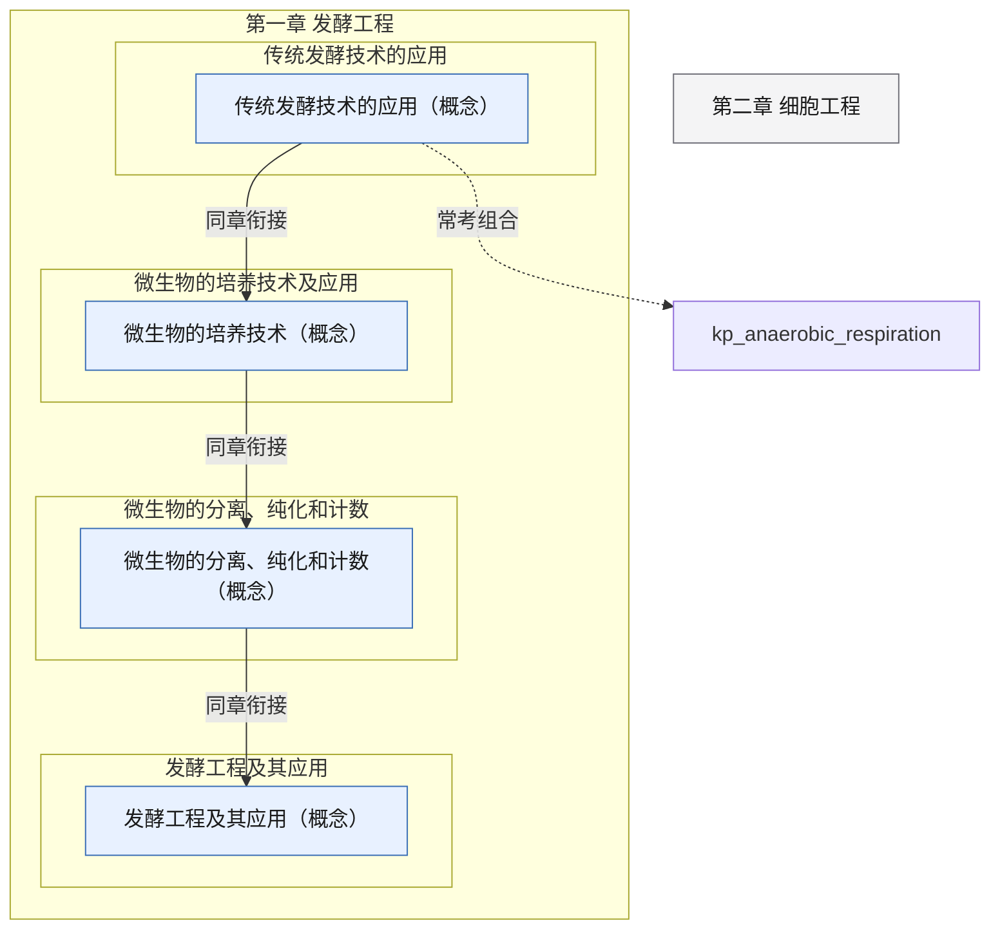

学生问人教版《生物学 选择性必修3 生物技术与工程》（2019）第一章的知识图谱时，从「整章图」那一行起原样输出，不要改节点、边和配色。

整章图：人教版《生物学 选择性必修3 生物技术与工程》（2019）第一章

```mermaid
flowchart TD
  classDef concept fill:#E8F1FF,stroke:#3B6FB6,color:#1A1A1A
  classDef skill fill:#E7F6EE,stroke:#2E7D4F,color:#1A1A1A
  classDef experiment fill:#FFF4E5,stroke:#C47B17,color:#1A1A1A
  classDef later fill:#F4F4F5,stroke:#71717A,color:#1A1A1A
  subgraph ch["第一章 发酵工程"]
    subgraph s1["传统发酵技术的应用"]
      kp_traditional_fermentation["传统发酵技术的应用（概念）"]:::concept
    end
    subgraph s2["微生物的培养技术及应用"]
      kp_microbe_culture["微生物的培养技术（概念）"]:::concept
    end
    subgraph s3["微生物的分离、纯化和计数"]
      kp_microbe_isolation["微生物的分离、纯化和计数（概念）"]:::concept
    end
    subgraph s4["发酵工程及其应用"]
      kp_fermentation_engineering["发酵工程及其应用（概念）"]:::concept
    end
  end
  xbx3_ch2["第二章 细胞工程"]:::later
  kp_traditional_fermentation -->|同章衔接| kp_microbe_culture
  kp_microbe_culture -->|同章衔接| kp_microbe_isolation
  kp_microbe_isolation -->|同章衔接| kp_fermentation_engineering
  kp_traditional_fermentation -.->|常考组合| kp_anaerobic_respiration
```

图例：蓝=概念，绿=技能，橙=实验，灰=后续章节。实线=直接前置或同章衔接，虚线=常考组合。

先学哪个节点：传统发酵技术、微生物的培养技术，还是发酵工程及其应用？
