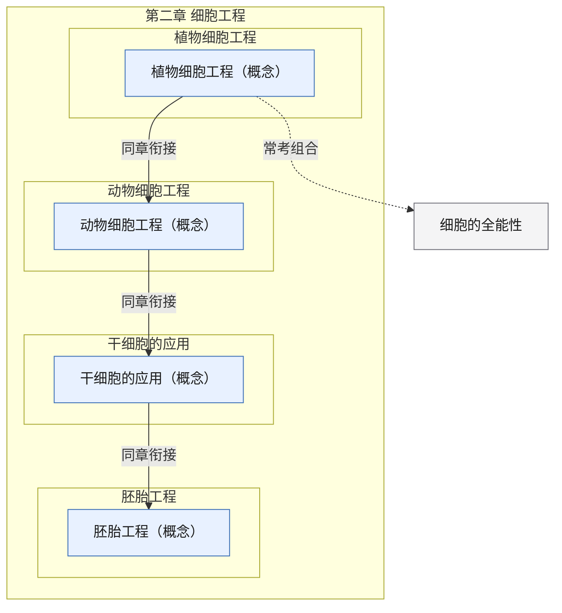

学生问人教版《生物学 选择性必修3 生物技术与工程》（2019）第二章的知识图谱时，从「整章图」那一行起原样输出，不要改节点、边和配色。

整章图：人教版《生物学 选择性必修3 生物技术与工程》（2019）第二章

```mermaid
flowchart TD
  classDef concept fill:#E8F1FF,stroke:#3B6FB6,color:#1A1A1A
  classDef skill fill:#E7F6EE,stroke:#2E7D4F,color:#1A1A1A
  classDef experiment fill:#FFF4E5,stroke:#C47B17,color:#1A1A1A
  classDef later fill:#F4F4F5,stroke:#71717A,color:#1A1A1A
  subgraph ch["第二章 细胞工程"]
    subgraph s1["植物细胞工程"]
      kp_plant_cell_engineering["植物细胞工程（概念）"]:::concept
    end
    subgraph s2["动物细胞工程"]
      kp_animal_cell_engineering["动物细胞工程（概念）"]:::concept
    end
    subgraph s3["干细胞的应用"]
      kp_stem_cell_application["干细胞的应用（概念）"]:::concept
    end
    subgraph s4["胚胎工程"]
      kp_embryo_engineering["胚胎工程（概念）"]:::concept
    end
  end
  kp_plant_cell_engineering -->|同章衔接| kp_animal_cell_engineering
  kp_animal_cell_engineering -->|同章衔接| kp_stem_cell_application
  kp_stem_cell_application -->|同章衔接| kp_embryo_engineering
  kp_plant_cell_engineering -.->|常考组合| kp_totipotency["细胞的全能性"]:::later
```

图例：蓝=概念，绿=技能，橙=实验，灰=后续章节。实线=直接前置或同章衔接，虚线=常考组合。

先学哪个节点：植物细胞工程、动物细胞工程，还是胚胎工程？
