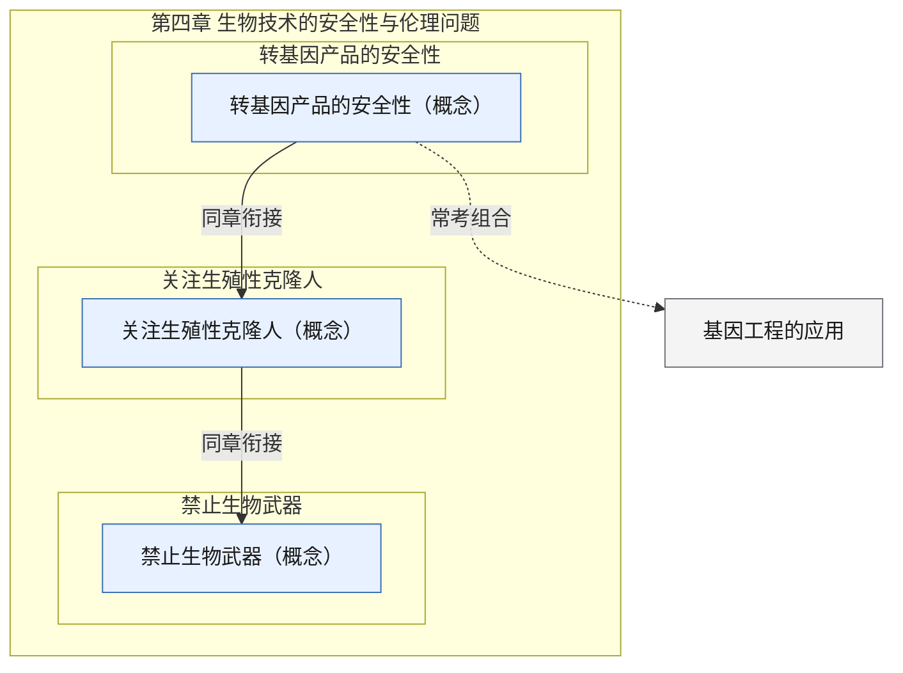

学生问人教版《生物学 选择性必修3 生物技术与工程》（2019）第四章的知识图谱时，从「整章图」那一行起原样输出，不要改节点、边和配色。

整章图：人教版《生物学 选择性必修3 生物技术与工程》（2019）第四章

```mermaid
flowchart TD
  classDef concept fill:#E8F1FF,stroke:#3B6FB6,color:#1A1A1A
  classDef skill fill:#E7F6EE,stroke:#2E7D4F,color:#1A1A1A
  classDef experiment fill:#FFF4E5,stroke:#C47B17,color:#1A1A1A
  classDef later fill:#F4F4F5,stroke:#71717A,color:#1A1A1A
  subgraph ch["第四章 生物技术的安全性与伦理问题"]
    subgraph s1["转基因产品的安全性"]
      kp_gmo_safety["转基因产品的安全性（概念）"]:::concept
    end
    subgraph s2["关注生殖性克隆人"]
      kp_cloning_ethics["关注生殖性克隆人（概念）"]:::concept
    end
    subgraph s3["禁止生物武器"]
      kp_biological_weapons["禁止生物武器（概念）"]:::concept
    end
  end
  kp_gmo_safety -->|同章衔接| kp_cloning_ethics
  kp_cloning_ethics -->|同章衔接| kp_biological_weapons
  kp_gmo_safety -.->|常考组合| kp_gene_engineering_applications["基因工程的应用"]:::later
```

图例：蓝=概念，绿=技能，橙=实验，灰=后续章节。实线=直接前置或同章衔接，虚线=常考组合。

先学哪个节点：转基因产品的安全性、关注生殖性克隆人，还是禁止生物武器？
