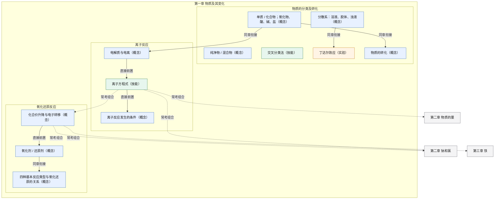

学生问人教版《化学 必修 第一册》（2019）第一章的知识图谱时，从「整章图」那一行起原样输出，不要改节点、边和配色。

示例（节名以学生教材为准）：

整章图：人教版《化学 必修 第一册》（2019）第一章

```mermaid
flowchart TD
  classDef concept fill:#E8F1FF,stroke:#3B6FB6,color:#1A1A1A
  classDef skill fill:#E7F6EE,stroke:#2E7D4F,color:#1A1A1A
  classDef experiment fill:#FFF4E5,stroke:#C47B17,color:#1A1A1A
  classDef later fill:#F4F4F5,stroke:#71717A,color:#1A1A1A
  subgraph ch1["第一章 物质及其变化"]
    subgraph s1["物质的分类及转化"]
      mix["纯净物 / 混合物（概念）"]:::concept
      compound["单质 / 化合物；氧化物、酸、碱、盐（概念）"]:::concept
      cross["交叉分类法（技能）"]:::skill
      colloid["分散系：溶液、胶体、浊液（概念）"]:::concept
      tyndall["丁达尔效应（实验）"]:::experiment
      transform["物质的转化（概念）"]:::concept
    end
    subgraph s2["离子反应"]
      ionize["电解质与电离（概念）"]:::concept
      ionEq["离子方程式（技能）"]:::skill
      ionCond["离子反应发生的条件（概念）"]:::concept
    end
    subgraph s3["氧化还原反应"]
      valence["化合价升降与电子转移（概念）"]:::concept
      agent["氧化剂 / 还原剂（概念）"]:::concept
      basic4["四种基本反应类型与氧化还原的关系（概念）"]:::concept
    end
  end
  ch2["第二章 钠和氯"]:::later
  ch2n["第二章 物质的量"]:::later
  ch3["第三章 铁"]:::later
  compound -->|同章衔接| transform
  colloid -->|同章衔接| tyndall
  compound -->|同章衔接| ionize
  ionize -->|直接前置| ionEq
  ionEq -->|直接前置| ionCond
  valence -->|直接前置| agent
  agent -->|同章衔接| basic4
  ionEq -.->|常考组合| valence
  ionEq -.->|常考组合| ch2
  valence -.->|常考组合| ch2
  valence -.->|常考组合| ch3
  ionEq -.->|常考组合| ch2n
```

图例：蓝=概念，绿=技能，橙=实验，灰=后续章节。实线=直接前置或同章衔接，虚线=常考组合。

先学哪个节点：物质的分类、离子反应，还是氧化还原？
